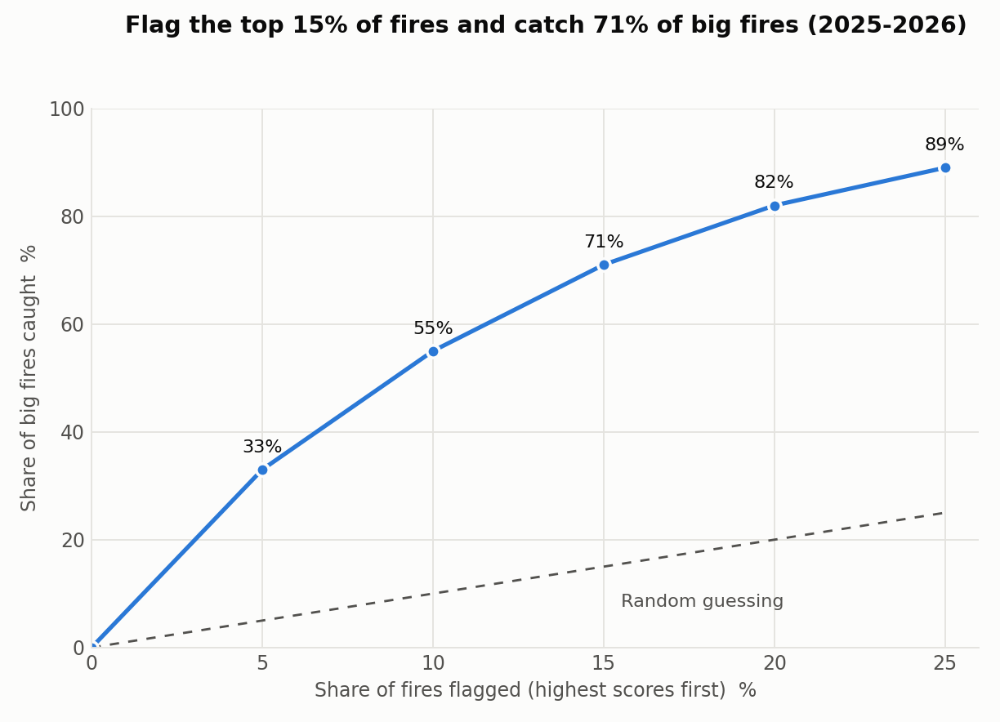
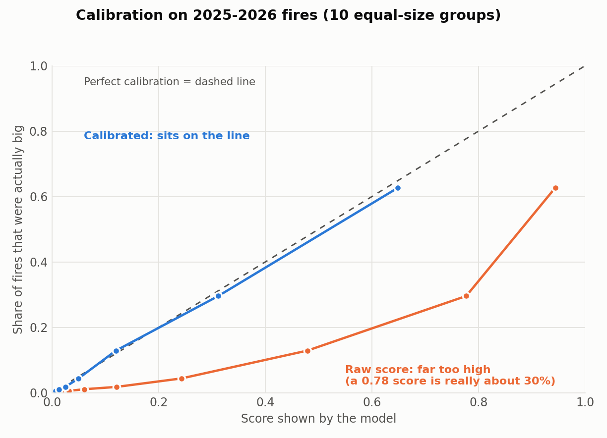

# Wildfire Canada — Big-Fire Risk Model

Predicting whether a newly reported Canadian wildfire will grow into a **big fire (>100 hectares)**, using only information available in the first hours after a fire is reported: weather, terrain, vegetation, satellite heat signal, and accessibility.

**Main model (v14.7): 22 features, no satellite, all known before the report day** (20 weather/land/people features plus latitude and longitude). 2025+ forward test: ROC-AUC 0.904 (0.897-0.912), PR-AUC 0.541 (0.513-0.571); alert threshold 0.695 catches 70% of big fires with 47% precision. The 24-feature satellite model below is an optional upgrade for when same-day detections are known to be available before scoring.

## Results (full 24-feature model: v14.6, forward-tested on 2025-2026)

Trained on 2004-2021 fires, features and threshold chosen on 2022-2024, then scored once on 2025-2026. These years were looked at by earlier model versions too, so this is a **forward test, not a perfectly untouched one**. The first truly untouched test will be 2027.

| Test | Fires (big) | ROC-AUC | PR-AUC |
|---|---|---|---|
| 2025+ | 11,145 (11.5% big) | 0.923 | 0.621 |
| 2025 | 6,184 | 0.915 | 0.582 |
| 2026 | 4,961 (672) | 0.929 | 0.656 |

Scores are on the repaired v4 dataset (2,584 missing 2025 fires added; before the repair 2025+ was 0.929 / 0.634). The model card marks the few tables still on v3 (by-province, alert rules by year, QA audit). PR-AUC is the main metric: big fires are only about 8-14% of fires, so a random guess scores about 0.11.

**Satellite caveat:** the gain from the satellite columns comes entirely from detections on the report day. A model with no satellite columns (known before the report day) scores ROC-AUC 0.901 (0.893-0.909) and PR-AUC 0.531 (0.506-0.562) on 2025+, against 0.923 and 0.621 for the full model. See the satellite timing audit in the [model card](docs/model_card.md).

**Alert rule:** raw score >= 0.770 catches 72% of big fires, and 52% of flagged fires are truly big. Flagging the top 15% by score catches 69%.

**Calibration:** the raw scores are not probabilities. A Platt calibrator (fitted on 2022-2024) cuts the Brier score from 0.119 to 0.063 on 2025+ and keeps the average chance close to the real rate in both years. A raw score of 0.770 is about a 29% chance.





*Charts use the 2025-2026 forward test. The calibration chart is from the model trained to 2021 with the calibrator fitted on 2022-2024.*

### What drives the score

Removing three "remoteness" columns (road distance and two population counts) costs the most ROC-AUC. Removing the four satellite columns costs the most PR-AUC. Weather adds little once those are in. On the same 2025 fires, a logistic model on the fire weather index reaches ROC-AUC 0.67, against 0.92 for this model. Tables and caveats are in the [model card](docs/model_card.md).

### Monitoring

A one-page health check (alert rate by month, calibration, missing data, drift) is in [`monitoring/`](monitoring/). Open `monitoring/dashboard.html` in a browser (it still shows the 20-feature v14.6 no-satellite model until the v14.7 export is rerun). Numbers come from `monitoring/export_monitoring_tables.py`, and 2022-24 scores in it are in-sample.

Full details, QA audit, data audit and limits: [`docs/model_card.md`](docs/model_card.md). The older v14.1 card is kept in [`docs/archive/`](docs/archive/model_card_v14_1.md).

## Approach

This project follows one rule above all others: **an idea only counts if it survives a genuinely held-out forward test, not just cross-validation.**

The workflow for every candidate change:
1. Build the feature or model change
2. Validate on 2022–2024
3. If promising, forward-test on 2025 and 2026 — years the model has never seen in any form
4. Run a bootstrap confidence interval on the performance delta. A real effect should clear zero on *every* tested period, not just one.

Ideas that looked good in step 2 but failed step 4 were rejected, including:
- Hyperparameter tuning beyond sane defaults (overfit to validation, didn't generalize)
- FBP fuel type (didn't clear the bootstrap bar)
- Terrain ruggedness (near-random, AUC 0.529)
- Distance to water (0.899 correlated with road distance — no independent signal)
- Several earlier attempts to use pre-2012 historical fire data (each one failed to show a reproducible gain — see "Historical data" below for the one that finally worked)

Ideas that passed and are in the current model:
- Road distance (accessibility proxy — real, reproducible gain)
- 7-day pre-report weather (temperature, precipitation, wind, humidity, sunshine)
- Terrain (elevation, slope) and vegetation (NDVI)
- Satellite pre-detection (MODIS/VIIRS fire detections in the days before official report)
- Population within 10km/25km

## Key finding: regional limits

The model is strong nationally (ROC-AUC 0.91-0.92) but weaker in a few provinces/territories, most consistently **NT, YT, SK, and BC**. These regions have fewer fires, sparser weather stations, and different fire regimes than the provinces driving most of the national signal. This is disclosed rather than hidden — see `docs/model_card.md` for the full breakdown.

## A real bug found and fixed (v14 → v14.1)

While investigating why the model underperformed in NT/YT, a data-integrity bug was found: **NT/YT's terrain slope values in the training data were wrong** — near-zero for all 3,016 fires in that region, because the original terrain fetch's fallback (for locations above SRTM's ~60°N coverage limit) was implemented for elevation but never wired up for slope. Fresh Earth Engine queries against real fire coordinates confirmed the correct values (mean slope 5.37°, not the stored 0.18°).

The fix was retrained and bootstrap-validated before being adopted — no province showed a confirmed regression, and 2026 showed a confirmed national improvement. `final_model_v14_1.pkl` is the corrected production model; `final_model_v14.pkl` is kept for reference, not deleted.

## Repo structure

```
data_pipeline/     — fetch scripts (weather, terrain, satellite, roads, population)
modeling/          — feature config, training, evaluation
models/            — trained model bundles (.pkl)
live_scoring/      — score a brand-new fire report in real time (v14.6)
tests/             — tests for the live scorer and calibrator (fake web replies, no keys needed)
docs/              — model card, technical notes
notebooks/          — cleaned full-pipeline walkthrough
analysis/          — v14.2-v14.6 work: clean retrains, 2006-07 recovery, sensor checks, calibration
monitoring/        — dashboard page and the script that builds its summary numbers
audits/            — QA audit of the saved model and data-integrity audit
```

## Data sources

| Source | What it provides |
|---|---|
| Canadian National Fire Database (NFDB) | Fire records, size, cause, location, dates |
| Open-Meteo Archive API | 7-day pre-report weather |
| Google Earth Engine (SRTM / Copernicus DEM) | Elevation, slope |
| Google Earth Engine (MODIS NDVI) | Vegetation greenness |
| NASA FIRMS (MODIS/VIIRS) | Satellite fire/heat detections |
| Statistics Canada National Road Network | Distance to nearest road |
| Kontur Population Dataset | Population within 10km/25km |

## Model

LightGBM gradient-boosted trees, 24 features, binary classification (fire grows past 100ha or not). v14.6 uses 2004-2021 fires for training (the 2004-2011 years beat 2012-only training). The model gives raw scores; a separate Platt calibrator turns them into estimated chances.

## Limitations

- Weaker in low-fire-count / sparse-station regions (NT, YT, SK, BC)
- Only two forward-test years exist so far (2025, 2026), and they are not perfectly untouched. 2027 will be the first clean test
- Inside one province the ranking is weaker than the national score (ROC-AUC about 0.80-0.93)
- Human-caused fires are harder to rank (few are big)
- Population and road distance use one modern layer for all years
- Not independently reproduced by anyone outside this project
- Doesn't yet include lightning density or nearby-fire-activity features (identified as promising, not yet tested)

## Running the pipeline

```bash
pip install -r requirements.txt
python data_pipeline/02_fetch_weather.py
python data_pipeline/03_fetch_terrain.py
python data_pipeline/04_fetch_satellite.py
python data_pipeline/05_fetch_road_distance.py
python data_pipeline/06_fetch_population.py
python modeling/train_model.py
python modeling/evaluate_model.py
```
